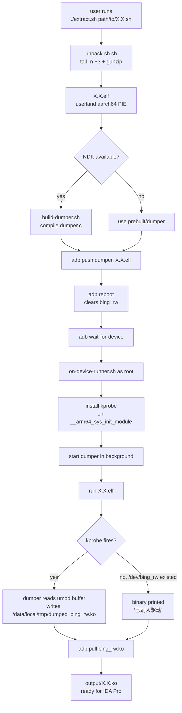
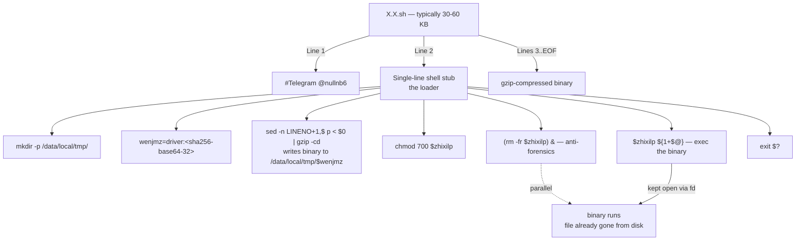
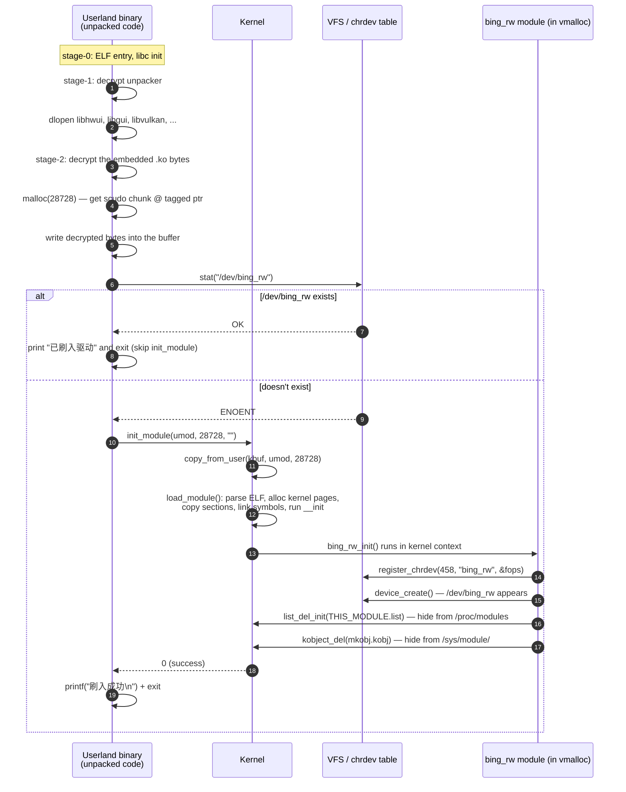
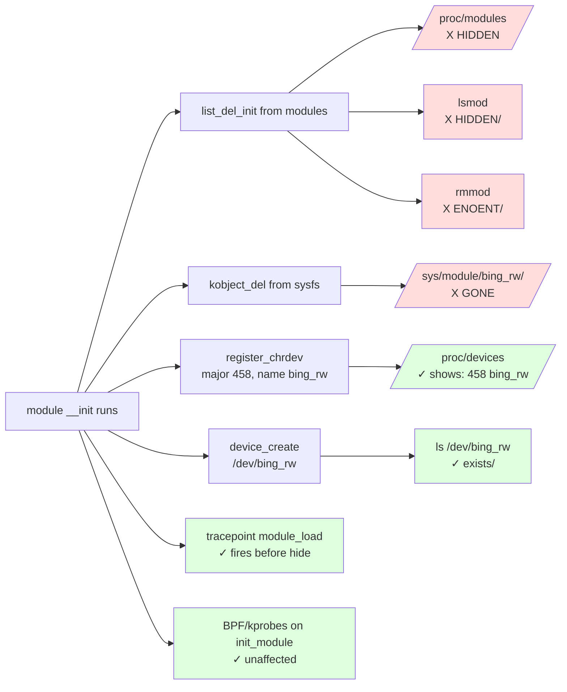
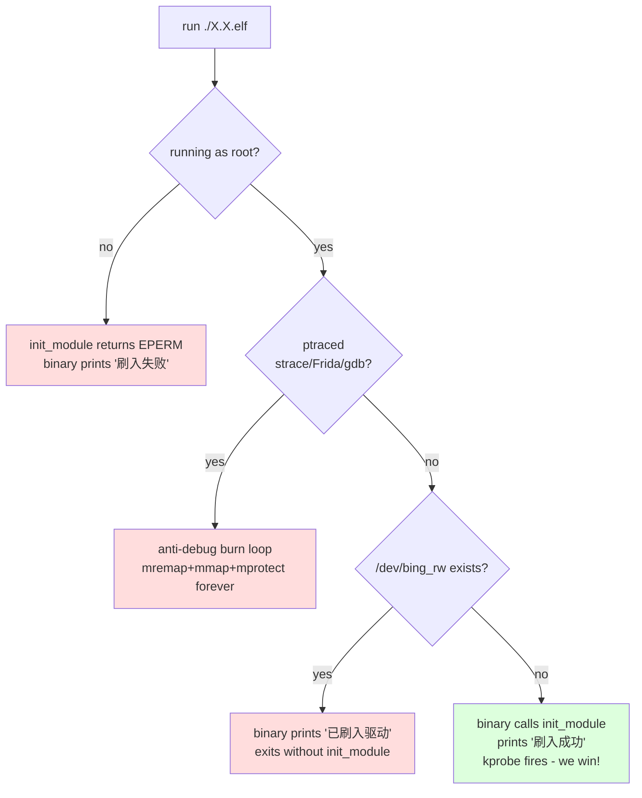

# Diagrams

All Mermaid. View in any modern Markdown viewer (VS Code, GitHub, GitLab, Obsidian, etc.).

---

## 1. Toolkit pipeline (high-level)



---

## 2. The `.sh` self-extractor anatomy



---

## 3. What happens when the binary runs as root



---

## 4. The kprobe extraction race

```mermaid
sequenceDiagram
    autonumber
    participant Bin as ft_test.elf
    participant K as Kernel
    participant TF as tracefs<br/>(trace_pipe)
    participant D as dumper (C)
    participant Out as /data/local/tmp/<br/>dumped_bing_rw.ko

    D->>K: write kprobe_events:<br/>p:ft_init_x __arm64_sys_init_module umod=+0(%x0):x64 len=+8(%x0):x64
    D->>K: enable kprobes/ft_init_x
    D->>TF: open("/sys/kernel/tracing/trace_pipe")<br/>blocking read

    Note over Bin: starts running
    Bin->>Bin: unpack stages 1, 2; decrypt .ko bytes
    Bin->>K: svc #0 with x8=105 (init_module)
    K->>TF: write event line:<br/>ft_init_x umod=0xb4...3320 len=0x7038
    TF-->>D: read returns line (~µs latency)

    D->>D: parse pid, umod, len from line
    D->>D: umod_addr = umod & 0x00FFFFFFFFFFFFFF<br/>(strip MTE top byte)
    D->>K: open("/proc/<pid>/mem", O_RDONLY)
    D->>K: lseek(umod_addr)
    D->>K: read(buf, 28728)
    K-->>D: 28728 bytes (the .ko bytes)
    D->>Out: write(buf, 28728)

    Note over K: meanwhile init_module is still running<br/>(load_module: parse, link, run __init)

    K-->>Bin: init_module returns 0
    Bin->>Bin: printf("刷入成功") + exit
```

---

## 5. `pt_regs` deref for syscall args on aarch64

```mermaid
flowchart LR
    SVC[binary executes:<br/>mov x0, &lt;umod&gt;<br/>mov x1, &lt;len&gt;<br/>mov x2, &lt;uargs&gt;<br/>mov x8, #105<br/>svc #0]

    SVC -->|enters kernel| WRAP[__arm64_sys_init_module]

    WRAP -->|x0 = pt_regs *| PR[struct pt_regs]
    PR -->|+0x00| R0[regs[0] = umod]
    PR -->|+0x08| R1[regs[1] = len]
    PR -->|+0x10| R2[regs[2] = uargs]
    PR -->|+0x18| R3[regs[3]]
    PR -->|...| RN[...]

    R0 -->|kprobe :x64| TR1[trace_pipe:<br/>umod=0xb4000076ffe73320]
    R1 -->|kprobe :x64| TR2[trace_pipe:<br/>len=0x7038]
```

---

## 6. MTE / TBI top-byte stripping

```mermaid
flowchart LR
    U[umod from kprobe<br/>0xb4 00 00 76 ff e7 33 20] -->|bits 63:56 = MTE tag| T[0xb4]
    U -->|bits 55:0 = real address| A[0x000000076ffe73320]

    style T fill:#fdd
    style A fill:#dfd

    A --> M[mask: addr &amp; 0x00FFFFFFFFFFFFFF]
    M -->|lseek SEEK_SET| MEM[/proc/&lt;pid&gt;/mem]
    MEM --> R[read 28728 bytes<br/>= the .ko file]
```

---

## 7. Module rootkit hide vs. observable surfaces



---

## 8. Why shell-based extraction lost (latency budgets)

```mermaid
gantt
    title Reaction time vs binary lifetime
    dateFormat X
    axisFormat %s ms
    todayMarker off

    section Binary (ms)
    stage-1 unpack         :a1, 0, 50
    stage-2 + decrypt .ko  :a2, 50, 100
    init_module syscall    :a3, 200, 70
    write success + exit   :a4, 270, 30

    section Shell daemon
    trace_pipe wakeup      :crit, b1, 200, 10
    awk fork + parse       :crit, b2, 210, 30
    dd fork + open + read  :crit, b3, 240, 60
    %% finishes too late: by 300ms binary is gone

    section C dumper
    trace_pipe wakeup      :done, c1, 200, 1
    parse + lseek + read   :done, c2, 201, 1
    write to disk          :done, c3, 202, 1
```



---

## 9. Decision tree: what kind of run gives what



---

## 10. End-to-end view

```mermaid
flowchart LR
    subgraph Host
        SH[X.X.sh]
        SH -->|tail+gunzip| ELF[X.X.elf]
        DUMC[dumper.c]
        DUMC -->|NDK clang| DUM[dumper aarch64 binary]
    end

    subgraph Device
        ELF -.adb push.-> DT[/data/local/tmp/X.X.elf]
        DUM -.adb push.-> DD[/data/local/tmp/dumper]
        DD -->|root| KP[kprobe installed]
        DT -->|root, no ptracer| RUN[ft_test.elf running]
        KP -.fires.-> EVT[trace_pipe event]
        RUN -.umod ptr.-> EVT
        EVT -.parsed.-> READ[/proc/&lt;pid&gt;/mem read]
        READ --> KO[/data/local/tmp/dumped_bing_rw.ko]
    end

    KO -.adb pull.-> OUT[output/X.X.ko]
    OUT --> IDA[IDA Pro]

    style ELF fill:#cef
    style KO fill:#cfc
    style OUT fill:#cfc
```
